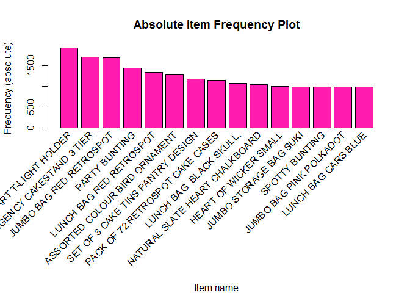
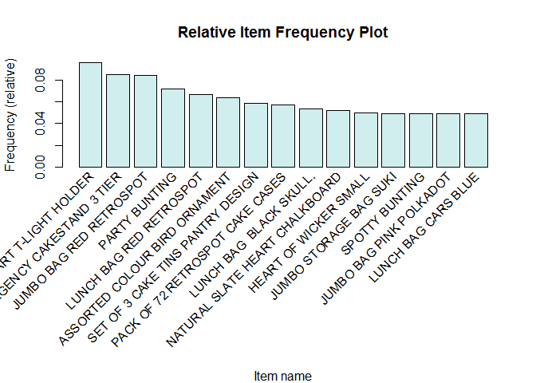
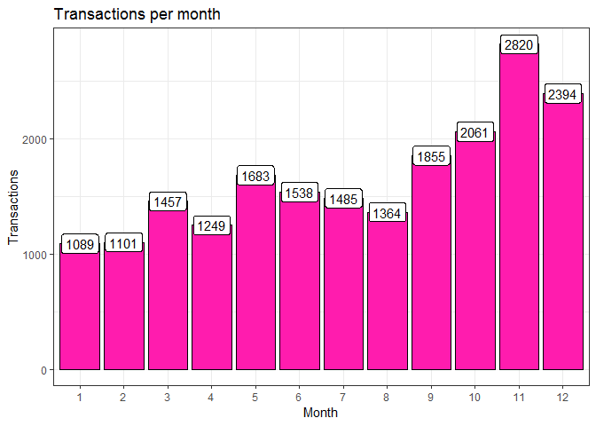
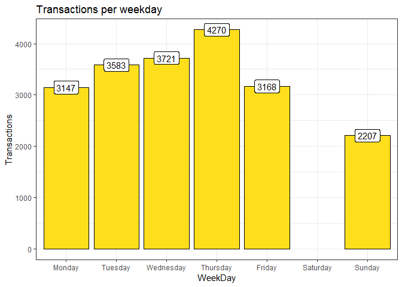
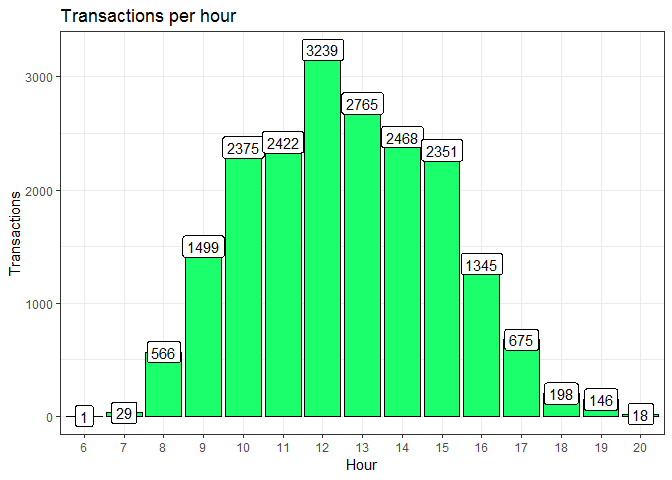
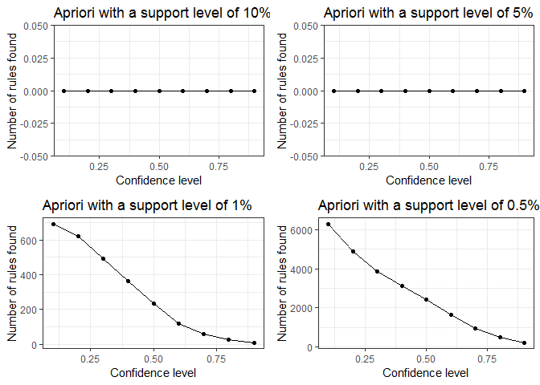
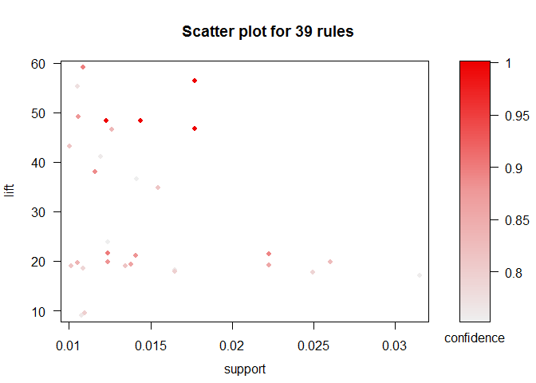
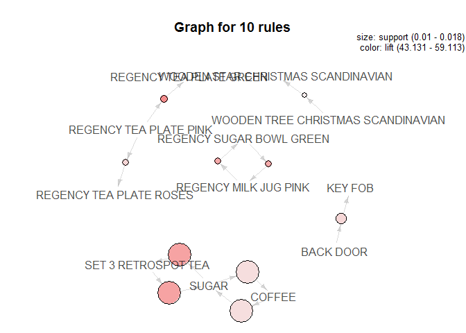

Let's install required packeges for Market Basket Analysis


```r
suppressPackageStartupMessages({
library(lubridate)
library(arules)
library(arulesViz)
library(plyr)
library(dplyr)
library(ggplot2)
library(gridExtra)
})
```

I am going to perform Market Basket Analysis on an online retail store data set.

The dat set is available t the UCI Machine Learning repository: [link](archive.ics.uci.edu/ml/datasets/online+retail)

#### Data Set Information:


This is a transnational data set which contains all the transactions occurring between 01/12/2010 and 09/12/2011 for a UK-based and registered non-store online retail.The company mainly sells unique all-occasion gifts. Many customers of the company are wholesalers.


##### Attribute Information:


**InvoiceNo:** Invoice number. Nominal, a 6-digit integral number uniquely assigned to each transaction. If this code starts with letter 'c', it indicates a cancellation.

**StockCode:** Product (item) code. Nominal, a 5-digit integral number uniquely assigned to each distinct product.

**Description:** Product (item) name. Nominal.

**Quantity:** The quantities of each product (item) per transaction. Numeric.

**InvoiceDate:** Invice Date and time. Numeric, the day and time when each transaction was generated.

**UnitPrice:** Unit price. Numeric, Product price per unit in sterling.

**CustomerID:** Customer number. Nominal, a 5-digit integral number uniquely assigned to each customer.

**Country:** Country name. Nominal, the name of the country where each customer resides


```r
setwd("F:\\E-learn\\Jigsaw\\Market Basket Analysis")
dataset = read.csv("Online_Retail.csv", na.strings = c("","NA"))
dim(dataset)
```

```
## [1] 541909      8
```

```r
str(dataset)
```

```
## 'data.frame':	541909 obs. of  8 variables:
##  $ ï..InvoiceNo: Factor w/ 25900 levels "536365","536366",..: 1 1 1 1 1 1 1 2 2 3 ...
##  $ StockCode   : Factor w/ 4070 levels "10002","10080",..: 3538 2795 3045 2986 2985 1663 801 1548 1547 3306 ...
##  $ Description : Factor w/ 4223 levels " 4 PURPLE FLOCK DINNER CANDLES",..: 4026 4034 931 1958 2979 3234 1572 1697 1694 258 ...
##  $ Quantity    : int  6 6 8 6 6 2 6 6 6 32 ...
##  $ InvoiceDate : Factor w/ 23260 levels "01-02-11 10:00",..: 709 709 709 709 709 709 709 710 710 711 ...
##  $ UnitPrice   : num  2.55 3.39 2.75 3.39 3.39 7.65 4.25 1.85 1.85 1.69 ...
##  $ CustomerID  : int  17850 17850 17850 17850 17850 17850 17850 17850 17850 13047 ...
##  $ Country     : Factor w/ 38 levels "Australia","Austria",..: 36 36 36 36 36 36 36 36 36 36 ...
```

```r
names(dataset)
```

```
## [1] "ï..InvoiceNo" "StockCode"    "Description"  "Quantity"     "InvoiceDate" 
## [6] "UnitPrice"    "CustomerID"   "Country"
```

## Data Pre-Processing and Exploration


```r
names(dataset)[1]<-"InvoiceNo" #Variable corresponding to invoice number is named as i..InvoiceNo, lets give it a meaningful name
names(dataset)
```

```
## [1] "InvoiceNo"   "StockCode"   "Description" "Quantity"    "InvoiceDate"
## [6] "UnitPrice"   "CustomerID"  "Country"
```

```r
#checking if there any missing values, in which column(s) are they missing, and how many of them are missing
any(is.na(dataset))
```

```
## [1] TRUE
```

```r
apply(dataset, 2, function(x) any(is.na(x)))
```

```
##   InvoiceNo   StockCode Description    Quantity InvoiceDate   UnitPrice 
##       FALSE       FALSE        TRUE       FALSE       FALSE       FALSE 
##  CustomerID     Country 
##        TRUE       FALSE
```

```r
sum(is.na(dataset$CustomerID))
```

```
## [1] 135080
```

```r
sum(is.na(dataset$Description))
```

```
## [1] 1454
```

```r
#cleaning the data set
dataset$InvoiceNo = as.character(dataset$InvoiceNo)

trim = function (x) gsub("^\\s+|\\s+$", "", x)
dataset$InvoiceNo = trim(dataset$InvoiceNo)

dataset$Description = trim(as.character(dataset$Description))

dataset$InvoiceDate = dmy_hm(dataset$InvoiceDate) #Converting the varibale InvoiceDate into a Date Object
```

```r
#The data description says that if invoice code starts with letter 'c', it indicates a cancellation.
#We can identify and remove such transactions as they are not much help to the analysis

is_C = function (x) startsWith(x,"C")
index = which(is_C(dataset$InvoiceNo)) #9288 cancelled transactions are there in the dataset
dataset2 = dataset[-index,] #Retaining the successful transactions into a new object

#Description for few items doesn't make sense, these could be unsuccessful transactions. We can identify and remove such transactions

library(stringr)
isUndesirable2 = function(x) {
  str_detect(toupper(x),"WRONG") | str_detect(toupper(x),"LOST") |
    str_detect(toupper(x),"CRUSHED") | str_detect(toupper(x),"DAMAGE") |
    str_detect(toupper(x),"FOUND") | str_detect(toupper(x),"THROWN") |
    str_detect(toupper(x),"SMASHED") |
    str_detect(toupper(x),"\\?") |
    str_detect(toupper(x),"AWAY") | str_detect(toupper(x),"CHARGES") |
    str_detect(toupper(x),"FEE") | str_detect(toupper(x),"FAULT")
  str_detect(toupper(x),"SALES") | str_detect(toupper(x),"ADJUST") |
    str_detect(toupper(x),"COUNTED") |
    str_detect(toupper(x),"INCORRECT") |
    str_detect(toupper(x),"BROKEN") | str_detect(toupper(x),"BARCODE") |
    str_detect(toupper(x),"RETURNED") |
    str_detect(toupper(x),"MAILOUT") | str_detect(toupper(x),"DELIVERY") |
    str_detect(toupper(x),"MIX UP") | str_detect(toupper(x),"MOULDY") |
    str_detect(toupper(x),"PUT ASIDE") | str_detect(toupper(x),"ERROR") |
    str_detect(toupper(x),"DESTROYED") | str_detect(toupper(x),"RUSTY")
}

dataset3 = dataset2[which(!isUndesirable2(as.character(dataset2$Description))),] #Omitting un-wanted transactions

dataset4 = subset(dataset3, dataset3$Quantity > 0) #Omitting transactions where ordered quanity is equal to zero
```

```r
#Each trasaction is split into number of rows based on number of unique items purchased in a transaction.
#for our analysis each transaction must have one row, InvoiceNo being the unique Id

items = ddply(dataset4,c("InvoiceNo"), function(x)paste(x$Description, collapse = ","))

head(items)
```

```
##   InvoiceNo
## 1    536365
## 2    536366
## 3    536367
## 4    536368
## 5    536369
## 6    536370
##                                                                                                                                                                                                                                                                                                                                                                                                                                                                                                                                          V1
## 1                                                                                                                                                                                                                                                                                                                   WHITE HANGING HEART T-LIGHT HOLDER,WHITE METAL LANTERN,CREAM CUPID HEARTS COAT HANGER,KNITTED UNION FLAG HOT WATER BOTTLE,RED WOOLLY HOTTIE WHITE HEART.,SET 7 BABUSHKA NESTING BOXES,GLASS STAR FROSTED T-LIGHT HOLDER
## 2                                                                                                                                                                                                                                                                                                                                                                                                                                                                                          HAND WARMER UNION JACK,HAND WARMER RED POLKA DOT
## 3                                                                                                                                                                                               ASSORTED COLOUR BIRD ORNAMENT,POPPY'S PLAYHOUSE BEDROOM,POPPY'S PLAYHOUSE KITCHEN,FELTCRAFT PRINCESS CHARLOTTE DOLL,IVORY KNITTED MUG COSY,BOX OF 6 ASSORTED COLOUR TEASPOONS,BOX OF VINTAGE JIGSAW BLOCKS,BOX OF VINTAGE ALPHABET BLOCKS,HOME BUILDING BLOCK WORD,LOVE BUILDING BLOCK WORD,RECIPE BOX WITH METAL HEART,DOORMAT NEW ENGLAND
## 4                                                                                                                                                                                                                                                                                                                                                                                                                          JAM MAKING SET WITH JARS,RED COAT RACK PARIS FASHION,YELLOW COAT RACK PARIS FASHION,BLUE COAT RACK PARIS FASHION
## 5                                                                                                                                                                                                                                                                                                                                                                                                                                                                                                                  BATH BUILDING BLOCK WORD
## 6 ALARM CLOCK BAKELIKE PINK,ALARM CLOCK BAKELIKE RED,ALARM CLOCK BAKELIKE GREEN,PANDA AND BUNNIES STICKER SHEET,STARS GIFT TAPE,INFLATABLE POLITICAL GLOBE,VINTAGE HEADS AND TAILS CARD GAME,SET/2 RED RETROSPOT TEA TOWELS,ROUND SNACK BOXES SET OF4 WOODLAND,SPACEBOY LUNCH BOX,LUNCH BOX I LOVE LONDON,CIRCUS PARADE LUNCH BOX,CHARLOTTE BAG DOLLY GIRL DESIGN,RED TOADSTOOL LED NIGHT LIGHT,SET 2 TEA TOWELS I LOVE LONDON,VINTAGE SEASIDE JIGSAW PUZZLES,MINI JIGSAW CIRCUS PARADE,MINI JIGSAW SPACEBOY,MINI PAINT SET VINTAGE,POSTAGE
```

```r
write.csv(items,"Items_List.csv",quote=FALSE, row.names = TRUE)

basket<-read.transactions("Items_List.csv", format="basket", sep=",",rm.duplicates=TRUE)
```

```
## distribution of transactions with duplicates:
## items
##    1    2    3    4    5    6    7    8    9   10   11   12   13   14   15   16 
## 1103  572  289  192  121  106   67   50   31   34   20   18   14    8    5    5 
##   17   18   19   20   21   22   23   24   25   26   37   38 
##   12    4    4    3    1    1    3    3    2    1    2    1
```

```r
summary(basket)
```

```
## transactions as itemMatrix in sparse format with
##  20097 rows (elements/itemsets/transactions) and
##  48954 columns (items) and a density of 0.0004604827 
## 
## most frequent items:
## WHITE HANGING HEART T-LIGHT HOLDER           REGENCY CAKESTAND 3 TIER 
##                               1927                               1707 
##            JUMBO BAG RED RETROSPOT                      PARTY BUNTING 
##                               1694                               1446 
##            LUNCH BAG RED RETROSPOT                            (Other) 
##                               1343                             444919 
## 
## element (itemset/transaction) length distribution:
## sizes
##    2    3    4    5    6    7    8    9   10   11   12   13   14   15   16   17 
##    1 1931  968  821  802  791  730  672  665  659  599  631  536  519  538  555 
##   18   19   20   21   22   23   24   25   26   27   28   29   30   31   32   33 
##  532  478  453  489  430  404  326  314  284  249  261  235  224  230  219  170 
##   34   35   36   37   38   39   40   41   42   43   44   45   46   47   48   49 
##  172  145  147  140  116  120  100  115  100   95   97   94   72   72   73   69 
##   50   51   52   53   54   55   56   57   58   59   60   61   62   63   64   65 
##   69   64   54   67   46   52   55   52   39   33   44   37   31   34   20   26 
##   66   67   68   69   70   71   72   73   74   75   76   77   78   79   80   81 
##   27   23   31   26   27   19   22   21   15   17   23   11   16   14   12   10 
##   82   83   84   85   86   87   88   89   90   91   92   93   94   95   96   97 
##   18   18   15    8    9   15   14   16   11    8    8   12   12    8    7    7 
##   98   99  100  101  102  103  104  105  106  107  108  109  110  111  112  113 
##    4    8    9    4    8    6    4    5    6    2    3    7    9    4    8    4 
##  114  115  116  118  119  120  121  122  123  124  125  126  127  128  129  130 
##    2    7    1    4    6    5    1    3    6    4    3    2    5    5    2    1 
##  131  132  133  134  135  136  137  138  139  140  141  142  143  144  145  146 
##    1    4    3    5    5    2    4    3    1    1    1    3    7    5    3    3 
##  147  148  149  150  152  153  154  155  156  157  158  159  160  161  162  164 
##    4    7    2    3    3    3    2    4    7    3    3    5    1    4    5    1 
##  165  166  169  170  171  172  173  174  175  176  177  178  179  180  181  182 
##    2    2    3    4    2    2    3    2    1    3    5    1    1    4    3    2 
##  183  184  185  186  187  188  189  191  194  195  196  198  199  200  203  204 
##    1    1    1    2    1    1    2    2    1    4    1    3    3    1    1    1 
##  206  207  208  209  210  211  214  215  217  219  221  222  226  228  229  230 
##    2    1    1    2    3    2    1    1    2    1    3    1    3    3    1    1 
##  232  234  236  238  240  242  243  250  251  252  254  258  259  260  262  263 
##    2    1    1    1    2    1    2    1    1    2    1    1    1    1    2    1 
##  265  267  268  272  274  276  283  286  287  293  300  303  305  307  314  316 
##    1    1    1    1    1    1    1    1    1    1    1    1    1    2    2    1 
##  322  323  328  329  331  334  340  341  346  350  352  362  367  369  377  393 
##    2    1    1    1    1    1    1    1    2    1    1    2    1    1    3    1 
##  396  400  402  404  413  421  431  433  444  449  462  470  473  479  511  516 
##    1    2    1    1    1    2    1    1    1    1    1    1    1    1    1    1 
##  532  589  642 
##    1    1    1 
## 
##    Min. 1st Qu.  Median    Mean 3rd Qu.    Max. 
##    2.00    7.00   15.00   22.54   26.00  642.00 
## 
## includes extended item information - examples:
##                    labels
## 1   *Boombox Ipod Classic
## 2 *USB Office Mirror Ball
## 3                       ?
```

```r
class(basket)
```

```
## [1] "transactions"
## attr(,"package")
## [1] "arules"
```


### Exploring Transactional Data Through Visualizations

Before running Aprior algorithm on data, learn more about the transactions in the data set using visualization.

we can generate an `itemFrequencyPlot()` to create an item Frequency Bar Plot to view the distribution of products.


```r
# Absolute Item Frequency Plot
itemFrequencyPlot(basket, topN=15, type="absolute", col="#ff1cae",xlab="Item name", 
                  ylab="Frequency (absolute)", main="Absolute Item Frequency Plot")
```

<!-- -->


From the above graph, we can observe that WHITE HANGING HEART T-LIGHT HOLDER, REGENCY CAKESTAND 3 TIER and JUMBO BAG RED RETROSPOT are the most sold products.

The `itemFrequencyPlot()` allows us to show the absolute or relative values. If absolute it will plot numeric frequencies of each item independently. If relative it will plot how many times these items have appeared as compared to others, as it's shown in the following plot.


```r
# Relative Item Frequency Plot
itemFrequencyPlot(basket, topN=15, type="relative", col="lightcyan2", xlab="Item name", 
                  ylab="Frequency (relative)", main="Relative Item Frequency Plot")
```

<!-- -->


Let's explore the transactions data further with other visualizations, describing the time distribution using the ggplot() function.

* Transactions per month
* Transactions per Week Day
* Transactions per hour


```r
# Transactions per month
dataset4 %>%
  mutate(Month=as.factor(month(InvoiceDate))) %>%
  group_by(Month) %>%
  summarise(Transactions=n_distinct(InvoiceNo)) %>%
  ggplot(aes(x=Month, y=Transactions)) +
  geom_bar(stat="identity", fill="#ff1cae", 
           show.legend=FALSE, colour="black") +
  geom_label(aes(label=Transactions)) +
  labs(title="Transactions per month") +
  theme_bw()
```

<!-- -->

The data set includes transactions from 01/12/2010 to 09/12/2012. More transactions happend during November month compared to anyother months.


```r
# Transactions per Week Day
dataset4 %>%
  mutate(WeekDay=as.factor(weekdays(InvoiceDate))) %>%
  group_by(WeekDay) %>%
  summarise(Transactions=n_distinct(InvoiceNo)) %>%
  ggplot(aes(x=WeekDay, y=Transactions)) +
  geom_bar(stat="identity", fill="#FFDF1C", 
           show.legend=FALSE, colour="black") +
  geom_label(aes(label=Transactions)) +
  labs(title="Transactions per weekday") +
  scale_x_discrete(limits=c("Monday", "Tuesday", "Wednesday", "Thursday",
                            "Friday", "Saturday", "Sunday")) +
  theme_bw() 
```

<!-- -->


More transactions happend on Thursday compared to other week days. There are nor transactions on Saturday. 


```r
# Transactions per hour
dataset4 %>%
  mutate(Hour=as.factor(hour(InvoiceDate))) %>%
  group_by(Hour) %>%
  summarise(Transactions=n_distinct(InvoiceNo)) %>%
  ggplot(aes(x=Hour, y=Transactions)) +
  geom_bar(stat="identity", fill="#1CFF6D", show.legend=FALSE, colour="black") +
  geom_label(aes(label=Transactions)) +
  labs(title="Transactions per hour") +
  theme_bw()
```

<!-- -->


Frequency of transactions is higher during Noon (12 to 13 hrs)


## Generation of Association Rules 

I am using Aprior algorithm to generate association rules

The first step in order to create a set of association rules is to determine the optimal thresholds for support and confidence. If we set these values too low, then the algorithm will take longer to execute and we will get a lot of rules (most of them will not be useful). Then, what values do we choose? We can try different values of support and confidence and see graphically how many rules are generated for each combination.


```r
# Support and confidence values
supportLevels <- c(0.1, 0.05, 0.01, 0.005)
confidenceLevels <- c(0.9, 0.8, 0.7, 0.6, 0.5, 0.4, 0.3, 0.2, 0.1)

# Empty integers 
rules_sup10 <- integer(length=9)
rules_sup5 <- integer(length=9)
rules_sup1 <- integer(length=9)
rules_sup0.5 <- integer(length=9)

# Apriori algorithm with a support level of 10%
for (i in 1:length(confidenceLevels)) {
  
  rules_sup10[i] <- length(apriori(basket, parameter=list(sup=supportLevels[1], 
                                                         conf=confidenceLevels[i], target="rules")))
  
}

# Apriori algorithm with a support level of 5%
for (i in 1:length(confidenceLevels)){
  
  rules_sup5[i] <- length(apriori(basket, parameter=list(sup=supportLevels[2], 
                                                        conf=confidenceLevels[i], target="rules")))
  
}

# Apriori algorithm with a support level of 1%
for (i in 1:length(confidenceLevels)){
  
  rules_sup1[i] <- length(apriori(basket, parameter=list(sup=supportLevels[3], 
                                                        conf=confidenceLevels[i], target="rules")))
  
}

# Apriori algorithm with a support level of 0.5%
for (i in 1:length(confidenceLevels)){
  
  rules_sup0.5[i] <- length(apriori(basket, parameter=list(sup=supportLevels[4], 
                                                          conf=confidenceLevels[i], target="rules")))
  
}
```


In the following graphs we can see the number of rules generated with a support level of 10%, 5%, 1% and 0.5%.


```r
# Number of rules found with a support level of 10%

plot1 <- qplot(confidenceLevels, rules_sup10, geom=c("point", "line"), 
               xlab="Confidence level", ylab="Number of rules found", 
               main="Apriori with a support level of 10%") +
  theme_bw()

# Number of rules found with a support level of 5%
plot2 <- qplot(confidenceLevels, rules_sup5, geom=c("point", "line"), 
               xlab="Confidence level", ylab="Number of rules found", 
               main="Apriori with a support level of 5%") + 
  theme_bw()

# Number of rules found with a support level of 1%
plot3 <- qplot(confidenceLevels, rules_sup1, geom=c("point", "line"), 
               xlab="Confidence level", ylab="Number of rules found", 
               main="Apriori with a support level of 1%") + 
  theme_bw()

# Number of rules found with a support level of 0.5%
plot4 <- qplot(confidenceLevels, rules_sup0.5, geom=c("point", "line"), 
               xlab="Confidence level", ylab="Number of rules found", 
               main="Apriori with a support level of 0.5%") + 
    theme_bw()

# Subplot
grid.arrange(plot1, plot2, plot3, plot4, ncol=2)
```

<!-- -->


Let's analyze the results,

 * Support Level of 10% and 5%: there are no association rules

* support Level of 1%: there are about 100 rules with confidence level of 60% and at 75% there are about 50 rules
 
 * Support Level 0.5%: we are getting too many rules


**To sum it up, we are going to choose a support level 1% and confidence level 75%**


#####Apriori algorithm execution with a support level of 1% and a confidence level of 75%


```r
rules_sup1_conf50 <- apriori(basket, parameter=list(sup=0.01, conf=0.75))
```

```
## Apriori
## 
## Parameter specification:
##  confidence minval smax arem  aval originalSupport maxtime support minlen
##        0.75    0.1    1 none FALSE            TRUE       5    0.01      1
##  maxlen target   ext
##      10  rules FALSE
## 
## Algorithmic control:
##  filter tree heap memopt load sort verbose
##     0.1 TRUE TRUE  FALSE TRUE    2    TRUE
## 
## Absolute minimum support count: 200 
## 
## set item appearances ...[0 item(s)] done [0.00s].
## set transactions ...[48954 item(s), 20097 transaction(s)] done [0.26s].
## sorting and recoding items ... [571 item(s)] done [0.01s].
## creating transaction tree ... done [0.01s].
## checking subsets of size 1 2 3 4 done [0.02s].
## writing ... [39 rule(s)] done [0.00s].
## creating S4 object  ... done [0.00s].
```

```r
basket_rules = sort(rules_sup1_conf50, by='lift', decreasing = TRUE) #Top 10 association rules by lift

summary(basket_rules)
```

```
## set of 39 rules
## 
## rule length distribution (lhs + rhs):sizes
##  2  3  4 
## 20 16  3 
## 
##    Min. 1st Qu.  Median    Mean 3rd Qu.    Max. 
##   2.000   2.000   2.000   2.564   3.000   4.000 
## 
## summary of quality measures:
##     support          confidence          lift            count      
##  Min.   :0.01005   Min.   :0.7513   Min.   : 9.055   Min.   :202.0  
##  1st Qu.:0.01127   1st Qu.:0.7914   1st Qu.:19.319   1st Qu.:226.5  
##  Median :0.01408   Median :0.8328   Median :36.649   Median :283.0  
##  Mean   :0.01528   Mean   :0.8604   Mean   :34.542   Mean   :307.2  
##  3rd Qu.:0.01771   3rd Qu.:0.8980   3rd Qu.:47.524   3rd Qu.:356.0  
##  Max.   :0.03150   Max.   :1.0000   Max.   :59.113   Max.   :633.0  
## 
## mining info:
##    data ntransactions support confidence
##  basket         20097    0.01       0.75
```

```r
inspect(basket_rules[1:10])
```

```
##      lhs                             rhs                        support   
## [1]  {REGENCY TEA PLATE PINK}     => {REGENCY TEA PLATE GREEN}  0.01084739
## [2]  {SUGAR}                      => {SET 3 RETROSPOT TEA}      0.01771409
## [3]  {SET 3 RETROSPOT TEA}        => {SUGAR}                    0.01771409
## [4]  {COFFEE,SUGAR}               => {SET 3 RETROSPOT TEA}      0.01771409
## [5]  {COFFEE,SET 3 RETROSPOT TEA} => {SUGAR}                    0.01771409
## [6]  {REGENCY SUGAR BOWL GREEN}   => {REGENCY MILK JUG PINK}    0.01054884
## [7]  {REGENCY MILK JUG PINK}      => {REGENCY SUGAR BOWL GREEN} 0.01054884
## [8]  {REGENCY TEA PLATE PINK}     => {REGENCY TEA PLATE ROSES}  0.01059860
## [9]  {BACK DOOR}                  => {KEY FOB}                  0.01229039
## [10] {SHED}                       => {KEY FOB}                  0.01438026
##      confidence lift     count
## [1]  0.8971193  59.11281 218  
## [2]  1.0000000  56.45225 356  
## [3]  1.0000000  56.45225 356  
## [4]  1.0000000  56.45225 356  
## [5]  1.0000000  56.45225 356  
## [6]  0.7737226  55.33631 212  
## [7]  0.7544484  55.33631 212  
## [8]  0.8765432  49.06933 213  
## [9]  1.0000000  48.31010 247  
## [10] 1.0000000  48.31010 289
```


The output can be interpreted in the below way

*89% customers who bought 'REGENCY TEA PLATE PINK' also bought 'REGENCY TEA PLATE GREEN'
*100% customers who bought 'COFFEE,SUGAR' also bought 'SET 3 RETROSPOT TEA'


Visualizing the output from Aprior Algorithm


```r
# Scatter plot
plot(rules_sup1_conf50, measure=c("support","lift"), shading="confidence", jitter=0)
```

<!-- -->

```r
# Graph
plot(rules_sup1_conf50[1:10], method="graph")
```

<!-- -->

```r
#Grouped matrix plot
#plot(rules_sup1_conf50[1:5], method="grouped")
```


